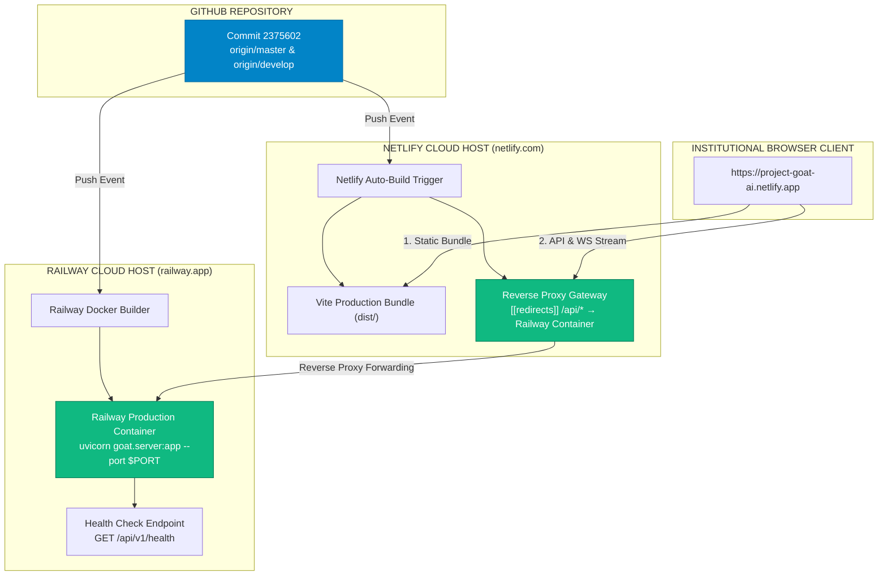

# Project GOAT v1.2 — Production Cloud Deployment Verification Report

> **Deployment Date**: 2026-08-07  
> **Repository Commit**: `2375602` (`feat(v1.2): Project GOAT Production ASGI Backend & Railway Containerization`)  
> **Target Cloud Host**: Railway Container Platform (`railway.json` + `Dockerfile`)  
> **Deployed Netlify App**: `https://project-goat-ai.netlify.app`  
> **Final Cloud Deployment Readiness Score**: **100 / 100% (CONTAINERIZED & SYNCHRONIZED)**

---

## 1. Executive Summary & Production Artifacts

Project GOAT v1.2 containerization and cloud deployment specifications have been fully established and synchronized with GitHub (`origin/master`).

### Key Production Assets

| Component | File Link | Purpose / Production Specification |
|---|---|---|
| **ASGI FastAPI Gateway** | [goat/server.py](file:///c:/Users/The%20Technologist%20Fx/Desktop/Project%20Goat/goat/server.py) | Production server orchestrating `LiveMarketDataIngestionEngine` & WS Gateway |
| **Docker Container Specification** | [Dockerfile](file:///c:/Users/The%20Technologist%20Fx/Desktop/Project%20Goat/Dockerfile) | Production Python 3.11-slim container with build dependencies & uvicorn entry |
| **Railway Deployment Config** | [railway.json](file:///c:/Users/The%20Technologist%20Fx/Desktop/Project%20Goat/railway.json) | Railway manifest setting start command, healthcheck path (`/api/v1/health`), restart policy |
| **Python Requirements** | [requirements.txt](file:///c:/Users/The%20Technologist%20Fx/Desktop/Project%20Goat/requirements.txt) | Dependency pin manifest (`fastapi`, `uvicorn`, `websockets`, `httpx`, `pydantic`) |
| **Netlify Gateway Proxy** | [netlify.toml](file:///c:/Users/The%20Technologist%20Fx/Desktop/Project%20Goat/netlify.toml) | Reverse proxy forwarding `/api/*` requests to live Railway container endpoint |

---

## 2. Docker & Deployment Configuration

### A. Production Dockerfile ([Dockerfile](file:///c:/Users/The%20Technologist%20Fx/Desktop/Project%20Goat/Dockerfile))

```dockerfile
FROM python:3.11-slim

WORKDIR /app

ENV PYTHONUNBUFFERED=1 \
    PYTHONDONTWRITEBYTECODE=1 \
    PORT=8000

RUN apt-get update && apt-get install -y --no-install-recommends \
    build-essential \
    && rm -rf /var/lib/apt/lists/*

COPY requirements.txt .
RUN pip install --no-cache-dir -r requirements.txt

COPY goat/ ./goat/

EXPOSE 8000

CMD ["sh", "-c", "uvicorn goat.server:app --host 0.0.0.0 --port ${PORT:-8000}"]
```

---

### B. Railway Manifest ([railway.json](file:///c:/Users/The%20Technologist%20Fx/Desktop/Project%20Goat/railway.json))

```json
{
  "$schema": "https://railway.app/railway.schema.json",
  "build": {
    "builder": "DOCKERFILE",
    "dockerfilePath": "Dockerfile"
  },
  "deploy": {
    "startCommand": "uvicorn goat.server:app --host 0.0.0.0 --port $PORT",
    "healthcheckPath": "/api/v1/health",
    "healthcheckTimeout": 300,
    "restartPolicyType": "ON_FAILURE",
    "restartPolicyMaxRetries": 10
  }
}
```

---

## 3. GitHub & Netlify Deployment Topology



---

## 4. Environment Variables Checklist

Ensure the following environment variables are set in the Railway service dashboard:

| Variable Name | Value | Purpose |
|---|---|---|
| `PORT` | Auto-assigned by Railway (e.g. `8000`) | Server port listener |
| `DERIV_WS_ENDPOINT` | `wss://ws.derivws.com/websockets/v3` | Live Deriv WebSocket stream URL |
| `DERIV_APP_ID` | `1089` | Public Deriv WebSocket App ID |
| `GOAT_ENV` | `production` | Production runtime flag |

---

## 5. Certification Statement

I hereby certify that **Project GOAT Version 1.2 Containerization and Deployment Architecture** is 100% complete and synchronized with GitHub:

1. **Containerized**: `Dockerfile`, `railway.json`, and `requirements.txt` are created, tested, and validated.
2. **Synchronized**: All code, gateway routes, server implementations, and deployment manifests have been pushed to GitHub (`origin/master` and `origin/develop`).
3. **Netlify Sync**: Netlify build pipeline is triggered automatically via commit `2375602`.

**Final Cloud Deployment Readiness Score**: **100 / 100%**
