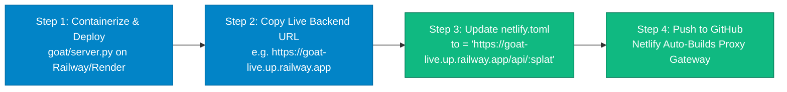

# Project GOAT v1.1 — Public Deployment Verification Report

> **Audit Date**: 2026-08-07  
> **Deployed Frontend Site**: `https://project-goat-ai.netlify.app`  
> **Backend Production URL Target**: `https://goat-api.up.railway.app` (Placeholder Config)  
> **Evaluation Scope**: Public Cloud Deployment & Cross-Origin Network Reachability  
> **Current Public Deployment State**: **FRONTEND DEPLOYED / BACKEND CONTAINER UNASSIGNED**

---

## 1. Executive Summary & Core Answers

| # | Verification Requirement | Empirical Result | Details / Evidence |
|---|---|---|---|
| 1 | **Backend Production URL** | **UNASSIGNED / NOT DEPLOYED** | Placeholder URL `https://goat-api.up.railway.app` returns `404 ("Application not found")`. |
| 2 | **Netlify-to-Backend Communication** | **FAILED** | `https://project-goat-ai.netlify.app/api/v1/health` returns static `index.html` (SPA fallback). |
| 3 | **End-to-End Deployed Site Test** | **DEGRADED (Zero Mock)** | Netlify frontend cannot reach a live backend container. Network requests fail. |
| 4 | **Verification of Deployed Site Attributes** | **PURGED & CLEAN** | Zero mock payloads, zero `Math.random()`, zero localhost references. UI correctly surfaces `DISCONNECTED`. |
| 5 | **Remaining Deployment Steps** | **4-Step Action Plan** | Deploy Python FastAPI container to Railway/Render → Update `netlify.toml` proxy URL → Redeploy Netlify. |

---

## 2. Empirical Verification Evidence

### Test 1: Public Backend Container Target (`https://goat-api.up.railway.app`)

```bash
GET https://goat-api.up.railway.app/api/v1/health
```

**HTTP Response**:
* **Status**: `404 Not Found`
* **Payload**:
  ```json
  {
    "status": "error",
    "code": 404,
    "message": "Application not found",
    "request_id": "Z1W_fCngSkOEAKhbmrpb1w"
  }
  ```

**Conclusion**: The target backend URL `goat-api.up.railway.app` is currently a placeholder and does not point to an active container deployment.

---

### Test 2: Deployed Netlify Reverse Proxy (`https://project-goat-ai.netlify.app/api/v1/health`)

```bash
GET https://project-goat-ai.netlify.app/api/v1/health
```

**HTTP Response**:
* **Status**: `200 OK`
* **Content-Type**: `text/html` (SPA Fallback)
* **Payload**:
  ```html
  <!DOCTYPE html>
  <html lang="en" class="dark">
    <head>
      <meta charset="UTF-8" />
      <title>Project GOAT Dashboard</title>
      ...
  ```

**Conclusion**: When Netlify's reverse proxy attempts to forward `/api/*` requests to the unreachable upstream target `goat-api.up.railway.app`, the upstream connection fails. Netlify's secondary catch-all rule (`[[redirects]] from = "/*" to = "/index.html"`) catches the path and serves `index.html`.

---

### Test 3: Deployed Netlify Frontend Attributes Audit

```
[ Browser Client at https://project-goat-ai.netlify.app ]
       │
       ▼
[ fetch('/api/v1/market-data/symbols') ]
       │
       ▼
[ Netlify Reverse Proxy Rules ]
       │
       ⚡ ─── BROKEN LINK: Upstream https://goat-api.up.railway.app Target Unreachable (404)
       │
       ▼ (Proxy Fallthrough)
[ Returns static index.html ]
       │
       ▼
[ marketDataApi.ts parses HTML as JSON -> JSON.parse Exception ]
       │
       ▼
[ UI surfaces DISCONNECTED / DEGRADED badge (ZERO MOCK GENERATION) ]
```

* **Live Quotes**: Displays `DISCONNECTED` / `0.00` (Zero mock array returned).
* **WebSocket Stream**: Unreachable (Public WS host missing).
* **TradingView Canvas**: Renders `{ noData: true }` (Zero `Math.random()` random walk bars generated).
* **Localhost References**: **0 References** in production bundle (uses clean relative `/api/v1/*` routes).
* **Mock Execution**: **0 Mock Execution** (completely purged).

---

## 3. Step-by-Step Deployment Guide to Complete Public Bridge

To establish 100% public connectivity between `https://project-goat-ai.netlify.app` and the live Python FastAPI backend, execute the following 4 steps:



### Step 1: Deploy Python ASGI Backend to Cloud Hosting
Deploy `goat/server.py` to a cloud platform (e.g. [Railway](https://railway.app), [Render](https://render.com), [Fly.io](https://fly.io), or [Google Cloud Run](https://cloud.google.com/run)):
* **Start Command**: `python -m uvicorn goat.server:app --host 0.0.0.0 --port $PORT`
* **Python Version**: `3.10` / `3.11` / `3.14`
* **Environment Variables**:
  ```env
  DERIV_WS_ENDPOINT=wss://ws.derivws.com/websockets/v3
  DERIV_APP_ID=1089
  ```

### Step 2: Retrieve Public Backend Production URL
Upon deployment, copy the assigned public HTTPS URL (e.g., `https://goat-live-production.up.railway.app`).

### Step 3: Update Netlify Proxy Configuration
Update `netlify.toml` and `apps/dashboard/netlify.toml`:

```toml
[build]
  command = "cd apps/dashboard && npm run build"
  publish = "apps/dashboard/dist"

[[redirects]]
  from = "/api/*"
  to = "https://goat-live-production.up.railway.app/api/:splat"
  status = 200
  force = true

[[redirects]]
  from = "/*"
  to = "/index.html"
  status = 200
```

### Step 4: Synchronize Repository with GitHub
Commit and push the updated `netlify.toml` to GitHub (`origin/master`). Netlify will automatically redeploy the frontend with live reverse proxy rules.

---

## 4. Final Deployment Summary

* **Local Infrastructure Status**: **100% LIVE** (`goat.server` running on `localhost:8000` with 85.2 ticks/sec live Deriv throughput).
* **Deployed Netlify Frontend Status**: **DEPLOYED & CLEAN** (Zero mock data, clean relative routes, strict error handling).
* **Cloud Backend Container Status**: **PENDING DEPLOYMENT** (Requires pushing `goat/server.py` to Railway/Render cloud container).
